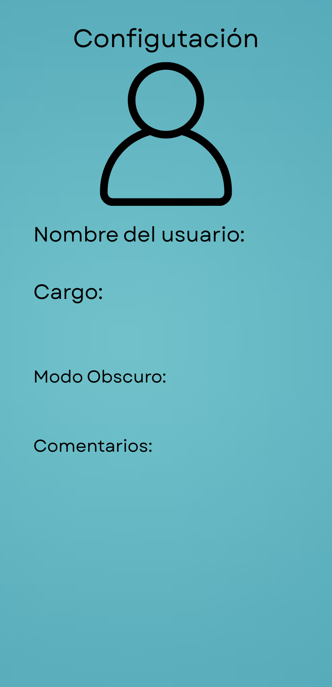

# MobiMant

**MobiMant** es una aplicación móvil nativa para Android diseñada para digitalizar y optimizar el proceso de mantenimiento en pymes del sector industrial. La app centraliza el registro, seguimiento y análisis de órdenes de mantenimiento, permitiendo una gestión más eficiente y segura mediante la integración de servicios en la nube.

---

## Tabla de Contenidos

1. [Descripción General](#descripción-general)
2. [Características Principales](#características-principales)
3. [Arquitectura y Tecnologías](#arquitectura-y-tecnologías)
4. [Estado Actual del Proyecto](#estado-actual-del-proyecto)
5. [Screenshots y Mockups](#screenshots-y-mockups)
6. [Instalación y Uso](#instalación-y-uso)
7. [Planificación del Proyecto](#planificación-del-proyecto)
8. [Equipo de Desarrollo](#equipo-de-desarrollo)
9. [Contribuciones](#contribuciones)
10. [Licencia](#licencia)
11. [Contacto](#contacto)

---

## Descripción General

En la industria manufacturera, el mantenimiento se ha gestionado tradicionalmente mediante métodos manuales o el uso de herramientas como Excel, registros en papel y llamadas telefónicas para reportar incidencias. Estas prácticas dan lugar a duplicidad de información, demoras y errores que afectan la productividad.

**MobiMant** surge para solucionar estas deficiencias al:
- Digitalizar el ciclo de vida de las órdenes de mantenimiento.
- Ofrecer una plataforma centralizada y en tiempo real para la gestión y consulta del estado de las máquinas.
- Mejorar la trazabilidad y reducir los tiempos de respuesta en la comunicación entre operadores, mecánicos y administradores.

---

## Características Principales

- **Gestión Integral de Mantenimiento:**
  - Registro, seguimiento y cierre de órdenes de mantenimiento.
  - Consulta en tiempo real del estado de las máquinas.
  
- **Integración con Firebase:**
  - **Firebase Authentication:** Registro e inicio de sesión, con roles diferenciados (administrador, operador y mecánico).
  - **Cloud Firestore:** Almacenamiento y consulta de información estructurada con soporte offline.
  - **Firebase Cloud Messaging (FCM):** Notificaciones push en tiempo real.
  - **Firebase Storage:** Almacenamiento seguro de imágenes (evidencias de incidencias).
  - **Firebase Analytics & Security Rules:** Seguimiento del uso y control de acceso.

- **Espacio de Trabajo Personalizado:**
  - Cada empresa dispone de su entorno dedicado para la administración y gestión de datos.

- **Interfaz Adaptada a Roles:**
  - **Operadores:** Generación de órdenes, adjuntar imágenes y recibir notificaciones.
  - **Mecánicos:** Visualización de órdenes asignadas, registro de avances y cierre de intervenciones.
  
- **Funcionalidad QR:**
  - Escaneo de códigos QR para acceder rápidamente a la ficha técnica de cada máquina.
  
- **Soporte Offline:**
  - Garantiza el funcionamiento incluso sin conexión, sincronizando los datos al reconectar.

---

## Arquitectura y Tecnologías

MobiMant se apoya en Firebase como backend, integrando múltiples servicios para lograr una solución escalable y segura:

- **Firebase Authentication:** Gestión de usuarios y autenticación.
- **Cloud Firestore:** Base de datos NoSQL para el sistema.
- **Firebase Cloud Messaging (FCM):** Gestión de notificaciones en tiempo real.
- **Firebase Storage:** Almacenamiento de archivos e imágenes.
- **Firebase Analytics:** Análisis y seguimiento de eventos.
- **Firebase Security Rules:** Políticas de acceso y seguridad.

El proyecto se desarrolla en **Android Studio**, utilizando una estructura modular que facilita la integración del frontend y el backend.

---

## Estado Actual del Proyecto

Hasta este momento, se han completado las siguientes etapas:

- **Etapa 1 – Diagnóstico y Contexto del Problema:**  
  Se identificaron las deficiencias en la gestión manual del mantenimiento, describiendo ejemplos como el uso de planillas Excel, llamadas telefónicas y registros en papel.

- **Etapa 2 – Propuesta del Proyecto:**  
  Se definió la solución MobiMant, detallando la integración con Firebase, los objetivos y el público objetivo.

- **Etapa 3 – Diseño de la Interfaz y Desarrollo Inicial:**  
  Se crearon mockups para pantallas clave (Registro, Inicio de Sesión, Registro y Gestión de Máquinas, Consulta de Estado, Notificaciones y Configuración) y se implementaron las primeras pantallas funcionales en Android Studio.

El repositorio contiene la documentación, diseños y el código fuente que respaldan cada una de estas etapas.

---

## Screenshots y Mockups

A continuación se presentan algunos mockups del proyecto. Las imágenes están alojadas en el directorio `fotos` del repositorio y se muestran con un ancho reducido para facilitar su visualización en GitHub.

### Pantalla de Registro de Máquinas
Esta vista permite ingresar datos como *Tipo de Máquina*, *Marca*, *Modelo*, *Motorización* y *Matrícula o Identificador*.
<br>


### Pantalla de Gestión de Máquinas
Permite agregar y visualizar máquinas, mostrando campos para *Nombre*, *Descripción*, *Último mantenimiento*, *Reparaciones realizadas* y *Características*.
<br>


### Pantalla de Consulta de Estado
Muestra el estado en tiempo real de las máquinas.
<br>


### Pantalla de Notificaciones
Visualización de alertas y notificaciones push ante incidencias.
<br>


### Pantalla de Configuración
Permite administrar perfiles, roles y ajustes de la aplicación.
<br>


*Nota: Los templates mostrados son preliminares y se irán ajustando a medida que avance el desarrollo del proyecto.*

---

## Instalación y Uso

### Requisitos
- **Android Studio** (última versión recomendada)
- Cuenta en **Firebase** para configurar los servicios (Authentication, Firestore, FCM, Storage, Analytics y Security Rules)

### Instrucciones de Instalación
1. **Clonar el repositorio:**
   ```bash
   git clone https://github.com/NicolasFluxa/MobiMant.git
